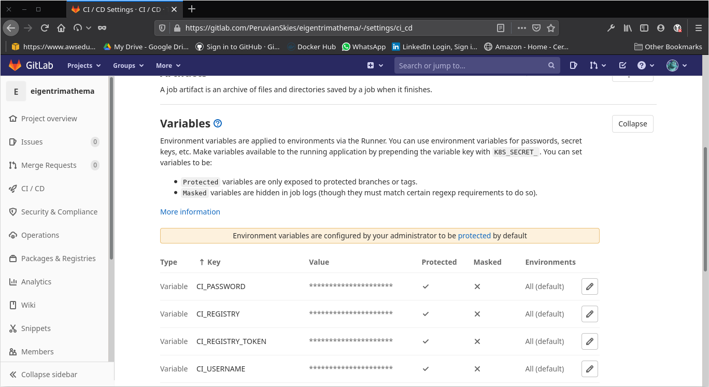

## CI/CD PIPELINE


Berikut Penjelasan dan langkah-langkah dari topologi di atas
1. User akan melakukan pull code terlebih dahulu yang berasal dari Gitlab
2. Jika telah selesai melakukan perubahan atau menambahkan baris coda, maka user melakukan push code ke Gitlab
3. Jika terdapat perubahan, Gitlab akan melakukan build source code
4. Jika proses build source code telah berhasil maka Gitlab akan melakukan build Docker Image, kemudian Image tersebut akan di buat pada registry gitlab container.
5. Setelah selesai membuat container registry, Gitlab akan melakukan deployment ke Heroku
6. Jika proses push docker image ke Heroku telah berhasil, maka Heroku akan menjalankan image tersebut.

### STEP by STEP
- Langkah pertama saya membuat Gitlab Repository, yang akan saya gunakan untuk memanage code aplikasi


- Kemudian saya membuat repository pada Heroku yang akan saya gunakan untuk mendeploy aplikasi


- Membuat file konfigurasi .gitlab-ci.yml dengan isi file sebagai berikut

```
stages:
  - package
  - push
  - deploy

.extendedjob:
  script:
    - docker login -u $CI_USERNAME -p $CI_REGISTRY_TOKEN $CI_REGISTRY
    - docker build -t registry.gitlab.com/peruvianskies/eigentrimathema .
    - docker push registry.gitlab.com/peruvianskies/eigentrimathema:latest

package:
  image: docker:latest
  services:
    - docker:dind
  stage: package
  extends: .extendedjob

push:
  image: docker:latest
  stage: push
  services:
    - docker:dind
  extends: .extendedjob
  script:
    - docker login -u $CI_USERNAME -p $CI_REGISTRY_TOKEN $CI_REGISTRY
    - docker pull registry.gitlab.com/peruvianskies/eigentrimathema:latest
    - docker login --username=_ --password=$CI_AUTH_TOKEN registry.heroku.com
    - docker tag registry.gitlab.com/peruvianskies/eigentrimathema:latest registry.heroku.com/eigentrimathema/web:latest
    - docker push registry.heroku.com/eigentrimathema/web:latest

deploy:
  image: node:latest
  stage: deploy
  services:
    - docker:dind
  extends: .extendedjob
  script:
    - npm install -g heroku
    - heroku container:release web --app eigentrimathema
```
- Pada Repository yang sudah saya buat tadi tambahkan beberapa variable pendukung


- Ketika semua sudah terkonfigurasi, selanjutnya push repository yang ada di lokalhost ke repository Gitlab


- Buka domain aplikasi yang diberikan oleh Heroku https://eigentrimathema.herokuapp.com/


Berikut beberapa dokumentasi ketika proses deploying

### Proses membuat image
 


### Proses push image docker ke container registry
 


### Proses deploy image ke Heroku


### Dashboard Heroku dan containery registry


### Notifikasi Yang dikirim via email


### Hasil akhir dari CICD Gitlab Docker

