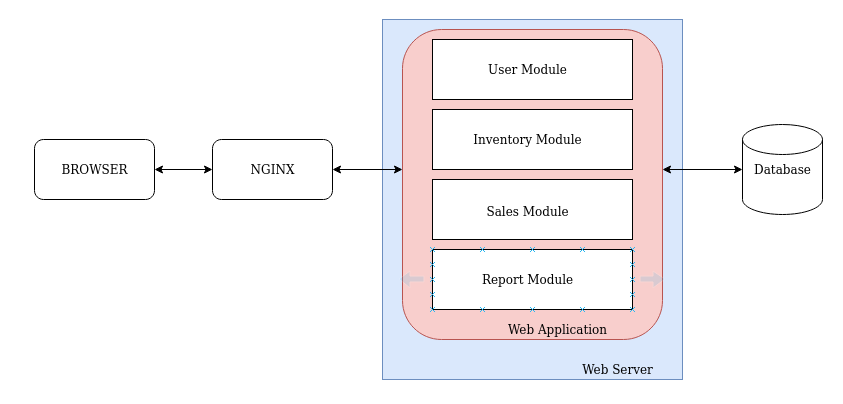
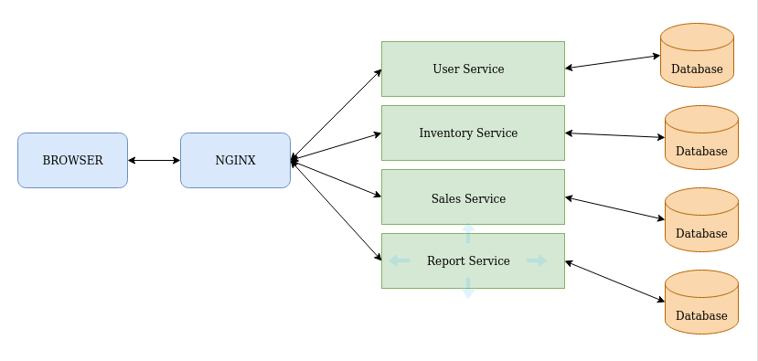

Pada gambar di atas sebuah Perusahaan memiliki sebuah server yang terdiri dari beberapa Module di dalamnya, yang bisa disebut monolith.
Perusahaan tersebut ingin migrasi dari infrastruktur monolith ke infrasturkture microservice, dengan beberapa komponen.

Pada gambar di atas terlihat beberapa komponen yang saya sebut sebagai service, service-service tersebut saling berkomunikasi dan saling bekerja sama melalui komunikasi network(network-call). Standarisasi yang digunakan untuk berkomunikasi yaitu menggunakan HTTP Method (Get,Post,Put,Delete,Dll).
Menggunakan versioning yang jelas sehingga perubahan yang terjadi tidak mengakibatkan terganggungnya client yang menggunakan API tersebut, contoh http://api.yourservice.com/v1/sales/34/employee.
Kemudian untuk sisi keamanan jika perusahaan tersebut menggunakan Cloud Computing semisalnya Amazon Web Service dimana sudah terdapat beberapa keamanan seperti NAT Gateway yang mana hanya satu service saja menggunakan IP Publik sedangkan service yang lain menggunakan IP private agar tidak bisa langsung di akses dari luar, sebagai contoh pada repository saya terdapat implementasi aplikasi yang menggunakan microservices NAT Gateway dengan konfigurasi Reverse Proxy dan Load Balancing application. [Referensi](https://github.com/PeruvianSkies/Devops-final)